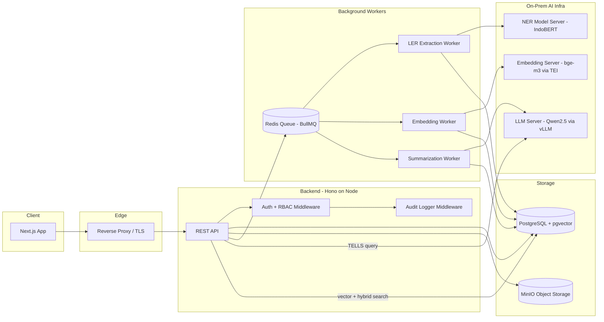
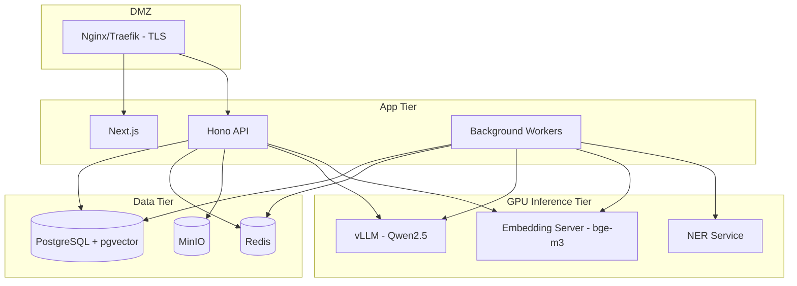

# Technical Approach & System Design

## SMDL — Sistem Manajemen Dokumen Legal (LER + RAG-based Assistant)

> Companion document to `PRD_SMDL.md`. This defines the concrete stack, data model, and RAG pipeline an implementation agent should follow. Constraints from the SRS that shape every decision here: **on-premise only for LER/SLM (DC-10)**, **HTTPS/TLS everywhere (DC-11)**, **RBAC enforced at every access point (DC-5)**, **audit everything (DC-6)**.

---

## 1. Stack Overview


| Layer                       | Choice                                                                                                                       | Why                                                                                                                                     |
| --------------------------- | ---------------------------------------------------------------------------------------------------------------------------- | --------------------------------------------------------------------------------------------------------------------------------------- |
| Frontend                    | **Next.js (App Router) + TypeScript**                                                                                        | Given                                                                                                                                   |
| Backend                     | **Hono** (Node.js runtime)                                                                                                   | Given — lightweight, fast, good middleware model, works fine on a plain Node server (not tied to edge, important since we need on-prem) |
| Primary DB                  | **PostgreSQL**                                                                                                               | Given                                                                                                                                   |
| Vector/RAG store            | **PostgreSQL +** `pgvector` **extension**                                                                                    | Same DB, no extra moving part — see §5                                                                                                  |
| Object storage              | **MinIO** (self-hosted, S3-compatible)                                                                                       | Keeps large binary files out of Postgres; on-prem; drop-in S3 SDK compatibility                                                         |
| Job queue                   | **BullMQ + Redis**                                                                                                           | Decouples upload from LER/embedding/SLM (must be async per NFR)                                                                         |
| Embedding model             | **BAAI/bge-m3** (self-hosted)                                                                                                | Multilingual incl. Indonesian, strong retrieval performance, open-weight — see §7                                                       |
| LLM (TELLS + summarization) | **Qwen2.5-14B-Instruct** (or 7B if GPU-constrained), optionally **Sahabat-AI / SEA-LION** for stronger Bahasa Indonesia tone | Open-weight, self-hostable, strong multilingual + instruction following — see §8                                                        |
| NER (LER module)            | **Fine-tuned IndoBERT / XLM-R token classifier**, LLM-prompt fallback                                                        | Purpose-built NER model is cheaper, faster, more precise than prompting an LLM for structured extraction — see §9                       |
| Model serving               | **vLLM** (LLM) + **TEI / sentence-transformers server** (embeddings)                                                         | Both self-hostable, no external API calls                                                                                               |
| Reverse proxy / TLS         | **Nginx or Traefik**                                                                                                         | TLS termination, satisfies DC-11                                                                                                        |
| Auth                        | Session-based (httpOnly cookie) + RBAC middleware, pluggable for future SSO/AD (DS-3)                                        | Simple now, extensible later                                                                                                            |


**Everything in this stack can run fully on-premise with no outbound calls to third-party AI APIs** — this is the hard constraint (`DC-10`, security §5.3 of the SRS) and it is the single biggest architectural decision driving the embedding/LLM/NER choices below.

---


## 2. High-Level Architecture 




**Flow summary:**

1. FE calls BE over HTTPS only.
2. BE authenticates + authorizes every request (RBAC middleware runs before any handler).
3. Every state-changing / sensitive request passes through an audit-logging middleware that writes to the `audit_log` table.
4. Document upload → file goes to MinIO, metadata row to Postgres, job enqueued (LER extraction + chunk/embedding).
5. Workers call the on-prem NER and embedding servers — never an external API.
6. TELLS query → BE does RBAC-filtered hybrid retrieval from Postgres → sends retrieved context + query to the on-prem LLM → streams answer back.

---


## 3. Frontend (Next.js)

- **App Router**, TypeScript strict mode.
- **Data fetching:** TanStack Query for server-state caching/invalidation; Next server actions only for simple mutations, otherwise call the Hono API directly from client with a typed API client (generate types from a shared `zod` schema package or OpenAPI spec to keep FE/BE contracts in sync — avoid hand-duplicated types).
- **UI:** shadcn/ui + Tailwind, matching the SRS UI conventions (toast feedback, confirm dialogs before destructive actions, primary/secondary/danger button variants, required-field asterisks).
- **State:** Server state via TanStack Query; minimal local/UI state via React state or Zustand only where truly needed (avoid a global store for everything — no overengineering).
- **Routing structure (indicative):**
  ```
  /login
  /              -> wiki / landing
  /documents     -> document management dashboard
  /documents/[id]-> document detail + LER panel
  /organizations -> org/team management
  /tells         -> chatbot (TELLS)
  /admin         -> admin dashboard (audit, config)
  /profile
  ```
- **Auth on FE:** httpOnly session cookie set by BE; FE never handles raw credentials/tokens in JS-accessible storage. Middleware (`middleware.ts`) checks session presence for route protection; actual authorization decision always re-validated server-side (never trust client-side role checks alone).
- **Streaming:** TELLS responses streamed via Server-Sent Events or the Fetch streaming API from Hono, rendered incrementally in the chat UI.

---


## 4. Backend (Hono)

- Runs as a standard **Node.js HTTP server process** (not Cloudflare Workers) — this matters because LER/embedding/LLM inference must stay on-prem and the backend needs to reach internal-network-only model servers.
- **Folder structure (indicative):**
  ```
  src/
    routes/
      auth.route.ts
      documents.route.ts
      organizations.route.ts
      tells.route.ts
      audit.route.ts
    middleware/
      auth.middleware.ts       // session validation
      rbac.middleware.ts       // permission check per route/resource
      audit.middleware.ts      // writes audit_log entries
      validate.middleware.ts   // zod schema validation
    services/
      document.service.ts
      ler.service.ts
      embedding.service.ts
      retrieval.service.ts
      tells.service.ts
      audit.service.ts
    jobs/
      queues.ts                // BullMQ queue defs
      workers/
        ler.worker.ts
        embedding.worker.ts
        summarize.worker.ts
    db/
      schema.ts                 // drizzle or kysely schema
      client.ts
  ```
- **Validation:** `zod` for every request body/query — reject invalid input server-side (SRS §5.3 mandates this).
- **RBAC middleware:** resolves `user -> role -> permitted actions`; for document-level checks, additionally verifies row-level ownership/org-membership/explicit-grant before allowing read/write (this cannot be done with role alone — needs a per-document ACL check, see §5).
- **Audit middleware:** wraps mutating routes (and TELLS queries) to always write an audit record — including on failure (SRS explicitly requires logging failed attempts too).
- **ORM:** **Drizzle ORM** (lightweight, SQL-first, plays well with raw pgvector queries which Drizzle doesn't abstract away — important since vector similarity queries need raw SQL operators like `<=>`).

---


## 5. Database Design (PostgreSQL)


### 5.1 Why Postgres + pgvector instead of a dedicated vector DB

- **Data residency:** everything stays in the one on-prem database — no separate vector DB service to secure/patch/backup.
- **RBAC-filtered retrieval is a JOIN, not a two-step round trip.** With a standalone vector DB (Pinecone/Weaviate/Qdrant/Milvus), you'd first fetch candidate IDs from the vector store, then re-check permissions in Postgres — extra latency and a class of bugs where you accidentally leak a chunk before the permission check runs. With `pgvector`, the ACL check and the similarity search happen in the **same SQL query** (`WHERE` clause + `ORDER BY embedding <=> query_vector`), which is both faster and safer.
- **Transactional consistency:** document metadata, ACLs, and embeddings update together in one transaction — no risk of the vector index drifting out of sync with the source of truth (a common failure mode with separate vector DBs).
- **Operational simplicity:** one DB to back up, one DB to restore, matches NFR backup/recovery requirements directly.
- Tradeoff being accepted: `pgvector` (IVFFlat/HNSW) doesn't scale as far as purpose-built vector DBs at hundreds-of-millions-of-vectors scale — but for a single corporate legal document corpus, this is well within Postgres's comfortable range (realistically low millions of chunks).


### 5.2 Core Schema (indicative, not exhaustive)

```sql
-- users & roles
create table users (
  id uuid primary key default gen_random_uuid(),
  email text unique not null,
  password_hash text not null,
  role text not null check (role in ('admin','owner','viewer','auditor')),
  created_at timestamptz default now()
);

-- organizations
create table organizations (
  id uuid primary key default gen_random_uuid(),
  name text not null,
  owner_id uuid references users(id),
  created_at timestamptz default now()
);

create table organization_members (
  organization_id uuid references organizations(id) on delete cascade,
  user_id uuid references users(id) on delete cascade,
  access_level text not null default 'member',
  primary key (organization_id, user_id)
);

-- documents
create table documents (
  id uuid primary key default gen_random_uuid(),
  title text not null,
  description text,
  category text,
  organization_id uuid references organizations(id),
  owner_id uuid references users(id) not null,
  storage_key text not null,        -- pointer to MinIO object
  file_format text not null check (file_format in ('pdf','docx')),
  file_size_bytes bigint not null,
  status text not null default 'processing', -- processing | ready | ler_failed
  created_at timestamptz default now(),
  updated_at timestamptz default now()
);

-- explicit per-document / per-org access grants (row-level ACL)
create table document_access (
  document_id uuid references documents(id) on delete cascade,
  grantee_type text not null check (grantee_type in ('user','organization')),
  grantee_id uuid not null,
  permission text not null check (permission in ('view','edit','manage')),
  primary key (document_id, grantee_type, grantee_id)
);

-- LER extracted entities (structured)
create table document_entities (
  id uuid primary key default gen_random_uuid(),
  document_id uuid references documents(id) on delete cascade,
  entity_type text not null,   -- e.g. PARTY, DATE, CONTRACT_NO, ORG, LOCATION
  entity_value text not null,
  confidence numeric,
  created_at timestamptz default now()
);

-- RAG chunks (text + embedding)
create extension if not exists vector;

create table document_chunks (
  id uuid primary key default gen_random_uuid(),
  document_id uuid references documents(id) on delete cascade,
  chunk_index int not null,
  content text not null,
  content_tsv tsvector generated always as (to_tsvector('indonesian', content)) stored,
  embedding vector(1024),        -- bge-m3 dimension
  created_at timestamptz default now()
);

create index on document_chunks using hnsw (embedding vector_cosine_ops);
create index on document_chunks using gin (content_tsv);

-- audit log (append-only, no update/delete grants for app role)
create table audit_log (
  id uuid primary key default gen_random_uuid(),
  user_id uuid references users(id),
  action text not null,
  object_type text,
  object_id uuid,
  status text not null check (status in ('success','failure')),
  ip_address inet,
  metadata jsonb,
  created_at timestamptz default now()
);
```

**Notes for the implementing agent:**

- `document_access` + `organization_members` together form the ACL used in every retrieval query's `WHERE` clause — never skip this join, even for TELLS.
- `audit_log` should be inserted via a DB role/permission that only has `INSERT`, no `UPDATE`/`DELETE`, to satisfy "audit log tidak boleh diubah" at the DB layer, not just the app layer.
- Use `hnsw` index (pgvector ≥0.5) over `ivfflat` for better recall/latency tradeoff at this document scale; requires periodic `VACUUM`/index maintenance same as any Postgres index — nothing exotic operationally.

---


## 6. Document Ingestion Pipeline

1. **Upload** → validate format/size/mimetype → store raw file in MinIO → insert `documents` row (`status = processing`) → enqueue `ler-extraction` and `embedding` jobs.
2. **Text extraction:** `pdf-parse` / `pdfjs-dist` for PDF, `mammoth` for DOCX → raw text.
3. **Chunking:** semantic/recursive chunking, ~500–800 tokens per chunk with ~10–15% overlap. Keep chunk boundaries paragraph-aware (don't split mid-sentence) — matters a lot for legal text where a clause split across chunks loses meaning.
4. **LER extraction (§9)** runs on the full document text (not per-chunk) since entities like "contract number" or "parties" are usually stated once and need whole-document context.
5. **Embedding (§7)** runs per-chunk, writes into `document_chunks.embedding`.
6. On completion, set `documents.status = ready`; on LER failure, set `ler_failed` **but keep the document and its chunks intact** (NFR: upload failure in LER must not lose the document).
7. Re-upload/edit → re-run steps 2–6, replacing chunks and entities for that document (transactional replace, not append).

---


## 7. Embedding Model — "What makes it RAG-friendly"

**Recommendation:** `BAAI/bge-m3` (self-hosted via Hugging Face Text Embeddings Inference or a plain `sentence-transformers` server behind a small FastAPI/Node wrapper).

Why this one specifically:

- **Multilingual, including Indonesian** — critical since source documents and TELLS queries will be in Bahasa Indonesia (with legal terms often mixed Indonesian/English).
- **Hybrid-friendly by design** — bge-m3 natively supports dense + sparse + multi-vector retrieval, but for MVP simplicity, use it purely as a dense embedding model and pair it with Postgres full-text search (`tsvector`) for the sparse/keyword side — see §10 hybrid retrieval.
- **Open-weight, self-hostable, no license blocker for commercial on-prem use** — satisfies the "no external AI API" constraint outright, since the weights run inside Telkom's infrastructure.
- **1024-dim output** — reasonable index size vs. accuracy tradeoff for `pgvector`.

Alternative if Indonesian-legal-domain accuracy needs a boost later: fine-tune `bge-m3` or swap to `intfloat/multilingual-e5-large` — both slot into the same pipeline without architecture changes since only the embedding server changes, not the retrieval code.

---


## 8. LLM for TELLS (Chat + Summarization)

**Recommendation:** `Qwen2.5-14B-Instruct` as the default; drop to `Qwen2.5-7B-Instruct` if GPU memory is constrained (fits comfortably on a single 24GB GPU quantized to 4-bit/AWQ).

Why:

- Strong multilingual performance including Bahasa Indonesia, good instruction-following for constrained/RAG-style prompting (i.e., "answer only from the provided context, cite the source, say you don't know if the context doesn't cover it").
- Open-weight, Apache-2.0-family license, runs entirely on-prem via **vLLM** — satisfies DC-10 outright.
- Good JSON-mode / structured-output reliability, useful both for TELLS answer formatting and as a fallback extraction mode for LER (§9).

**Domain/language-tuned alternative:** `Sahabat-AI` (GoTo/Indosat x Meta, Llama-3-based, Indonesian-tuned) or `SEA-LION` (AI Singapore, Southeast-Asia-focused). Worth a bake-off during implementation if Qwen's Bahasa Indonesia tone/formality isn't a good fit for corporate/legal register — but architecturally these are drop-in replacements behind the same vLLM serving layer, so don't block MVP on this choice.

**Serving:** vLLM for throughput (batches concurrent TELLS requests efficiently, matters for the "handle multiple concurrent TELLS requests" NFR). Ollama is a fine lower-effort alternative for early dev/staging, but vLLM is the production choice for concurrency + streaming support.

---


## 9. LER Module — NER Approach

Two viable approaches; pragmatic answer is to start with the second, and only invest in the first once labeled data exists.

**Option A (fine-tuned NER model) — better precision/cost, needs training data:**

- Model: `IndoBERT` (`indobenchmark/indobert-base-p1`) or `XLM-RoBERTa` fine-tuned as a token-classification model on a legal-entity-tagged dataset (parties, dates, contract numbers, organizations, locations, document type).
- Pros: fast (small model, CPU-viable), cheap to run at scale, deterministic, easy to evaluate with precision/recall per entity type.
- Cons: needs a labeled training set — likely doesn't exist yet for Telkom's legal corpus; requires an annotation effort before this is viable.

**Option B (LLM-prompted structured extraction) — usable from day one:**

- Use the same on-prem LLM (Qwen2.5) with a fixed JSON schema prompt: extract `{parties: [], dates: [], contract_number, organizations: [], location, document_type}` from the document text (chunked if the doc is long, then merged).
- Pros: zero training data needed, works immediately for MVP.
- Cons: slower and more expensive per document than a small NER model at scale; needs stricter output validation (JSON schema validation + retry-on-malformed-output).

**Recommended path:** ship MVP with **Option B** (LLM-prompted extraction against the on-prem LLM), log/store every extraction result, and use those results (post human-corrected where possible) as the seed training set to later train and switch to **Option A** once enough labeled examples accumulate. This avoids over-engineering the MVP while leaving a clear, non-wasteful upgrade path — no throwaway work either way, since both approaches feed the same `document_entities` table.

---


## 10. Retrieval Strategy (RAG for TELLS)

**Hybrid retrieval, RBAC-filtered, at query time:**

1. Embed the user's query with the same `bge-m3` model used for ingestion.
2. Run **one SQL query** that does all of the following together:
  - Vector similarity (`embedding <=> query_vector`, cosine distance via the `hnsw` index)
  - Full-text keyword match (`content_tsv @@ plainto_tsquery('indonesian', :query)`) — combine scores (e.g., reciprocal rank fusion of the two rankings, or a weighted sum) for hybrid results
  - **RBAC filter in the same** `WHERE` **clause:** join `documents` → `document_access` / `organization_members` to only include chunks from documents the requesting user can access. This is the piece that must never be skipped or done as an app-layer post-filter — do it in SQL so an unauthorized chunk is never even fetched into application memory.
3. Take top-k (e.g., k=8–12) chunks after fusion.
4. **Optional rerank step** (recommended once basic RAG is working): pass the top-k through a cross-encoder reranker (e.g., `bge-reranker-v2-m3`, also self-hostable) to reorder by true relevance before truncating to the final top-n (e.g., n=4–6) sent to the LLM — meaningfully improves answer quality over raw vector-similarity ordering alone, at a small extra latency cost.
5. Assemble a prompt: system instruction ("answer only from the provided context; if the context doesn't answer the question, say so; cite the source document title/ID for each claim") + the retrieved chunks + the LER entity summary for those documents + the conversation history for that TELLS session.
6. Call the LLM, stream the response back to the FE.
7. Log the query, retrieved doc IDs, and response to `audit_log` (per FR-101/FR-50).

This single design satisfies three SRS requirements simultaneously: RBAC-scoped answers (FR-46/FR-47), citation of source (FR-43), and audit logging (FR-50) — worth keeping all three in mind together when implementing this endpoint, since it's the most sensitive code path in the system.

---


## 11. Async Processing (Queue)

- **BullMQ + Redis**, three queues: `ler-extraction`, `embedding`, `summarization`.
- Each job is idempotent and keyed by `document_id` + a version/hash of the content, so re-uploads/edits safely replace prior results instead of duplicating.
- Retry policy: exponential backoff, max 3 attempts; on final failure, mark `documents.status = ler_failed` (document itself remains fully usable/downloadable — only LER-derived features degrade).
- Workers run as separate Node processes from the API server (can scale horizontally independently of the API, useful since LER/embedding load is bursty around uploads).

---


## 12. Security Implementation Notes

- Passwords: `bcrypt`/`argon2` hashed, never logged.
- Sessions: server-side session store (Postgres or Redis-backed), httpOnly + `Secure` + `SameSite=Strict` cookies, timeout per Telkom policy.
- Every route: `authMiddleware` → `rbacMiddleware` → `auditMiddleware` → handler. No handler should assume authorization already happened without seeing this chain applied.
- Error responses: generic messages to the client (`"Invalid request"`), full detail only in server-side logs — never return stack traces or SQL errors to the FE.
- File validation: check both the extension **and** actual file signature/mimetype (don't trust `Content-Type` header alone) before accepting an upload.
- All model-serving endpoints (embedding server, LLM server, NER server) bound to the internal network only — not exposed publicly, reachable only from the Hono backend/workers.

---


## 13. Deployment Topology (on-prem)




- Suggested minimum footprint: 1 GPU node (24GB+ VRAM) for `vLLM` + embedding + NER serving, 1 app node (FE + BE + workers, containerized), 1 data node (Postgres + Redis + MinIO) — can consolidate onto fewer physical machines for MVP, split later as load grows.
- All inter-node traffic on an internal network segment; only the reverse proxy is internet/corporate-network facing.
- Container orchestration: Docker Compose is sufficient for MVP; migrate to k8s only if/when multi-node scaling is actually needed (avoid adopting k8s complexity prematurely).

---


## 14. Summary Decision Table


| Decision            | Choice                                                       | Key reason                                                       |
| ------------------- | ------------------------------------------------------------ | ---------------------------------------------------------------- |
| Vector store        | pgvector inside Postgres                                     | RBAC-joined retrieval in one query, one DB to operate            |
| Embedding model     | bge-m3                                                       | Multilingual/Indonesian, self-hostable, no license/API blocker   |
| LLM                 | Qwen2.5-14B/7B-Instruct via vLLM                             | Self-hostable, strong Indonesian support, good structured output |
| NER/LER             | LLM-prompted JSON extraction now → fine-tuned IndoBERT later | Usable day one, clear no-waste upgrade path                      |
| Queue               | BullMQ + Redis                                               | Decouples heavy AI jobs from request path, satisfies async NFR   |
| Object storage      | MinIO                                                        | Keeps binaries out of Postgres, S3-compatible, on-prem           |
| Reranker (optional) | bge-reranker-v2-m3                                           | Meaningful quality bump on top-k before hitting the LLM          |


---

## 15. UI Design Guidelines (Frontend)

Reference implementation lives in `fe/app/globals.css`, `fe/components/landing/`, and shared app components. Agents building UI should follow these rules so new screens match the existing SMDL look.

### 15.1 Brand & color

| Token | Usage |
| ----- | ----- |
| `telkom-red` (`#E42313`) | Primary actions, active states, accents, links on hover |
| `telkom-red-dark` | Primary button hover |
| `telkom-black` | Headings, primary text |
| `telkom-grey-50` … `telkom-grey-800` | Surfaces, borders, secondary text |
| White | Main app background, cards, modals |

Do not introduce new accent colors for core flows. Status colors (success/error) are allowed sparingly.

### 15.2 Typography & spacing

- Page titles: `text-sm font-semibold` in app header; section titles `text-lg`–`text-xl font-semibold`.
- Body: `text-sm`, secondary copy `text-telkom-grey-600`.
- **Form fields:** label above control, **`flex flex-col gap-2`** between label and input.
- List/filter bars: same horizontal rhythm as Wiki/documents (`px-4 md:px-6`, `border-telkom-grey-200` dividers).

### 15.3 Radius & controls

| Element | Class |
| ------- | ----- |
| Text inputs, textareas, selects, cards in app | `rounded-xs` |
| Primary / secondary action buttons in app & wizards | **`rounded-none`** (square) |
| Landing marketing buttons | `rounded-sm` (slightly softer) |

- Textareas: **`resize-none`**, fixed min-height (e.g. `min-h-28`).
- Inputs in app: height `h-10`, border `border-telkom-grey-200`, focus ring `ring-telkom-red/10`.

### 15.4 Corner red accents (decorative)

Used on **landing hero** (soft blobs) and **selectable tiles** (scattered squares). For squares:

- Component: `fe/components/app/corner-red-grid.tsx` → `CornerRedGridPair`.
- **Not a filled grid** — use **random-sized squares** scattered in **top-left** and **bottom-right** corners only.
- Square sizes ~8–15px, spread loosely across an ~80px corner area, opacity ~0.07–0.15, `bg-telkom-red`.
- **Hover:** squares **move slightly toward each other** (converge) via `.corner-float-square` + CSS vars `--hx` / `--hy` — **no infinite float animation**.
- Content label stays **`relative z-10`** above decoration.

Landing hero (large sections) uses soft blobs:

```tsx
<div className="pointer-events-none absolute -right-32 -top-32 h-96 w-96 rounded-full bg-telkom-red/5" />
<div className="pointer-events-none absolute -bottom-20 -left-20 h-72 w-72 rounded-full bg-telkom-grey-100" />
```

Use **blobs** for hero/section backgrounds; use **scattered corner squares** for interactive tiles and wizard choices.

### 15.5 Wizards & modals (e.g. create organization)

- Centered modal, `rounded-xs` shell, backdrop `bg-black/45` + light blur.
- Step indicator + progress bar at top; **Back** control **top-left** (not footer).
- Footer: single primary **`Lanjut`** / **`rounded-none`** button, right-aligned; avoid duplicate skip actions unless PRD requires.
- Step content: slide animation (`animate-wizard-slide-in-right/left` in `globals.css`).
- Reuse `WizardField`, `wizardInputClass`, `wizardTextareaClass`, `wizardPrimaryBtnClass` from `fe/app/(app)/organizations/components/wizard-step-indicator.tsx`.

### 15.6 Lists, cards & filters

- Document/org lists: URL-driven filters; search bar pattern from `fe/app/(app)/wiki/components/search-filter.tsx`.
- Organization cards: text-first (name prominent), metadata chips `bg-telkom-grey-100`, no icon clutter unless PRD asks.
- Empty states: centered, `border-y border-telkom-grey-200 py-16`.

### 15.7 Do / don’t

| Do | Don’t |
| -- | ----- |
| Match Wiki filter/search UX for new list pages | Invent new filter UI per page |
| Keep decorative red **scattered in corners** | Cover entire cards or use solid square grids |
| Use design tokens from `globals.css` | Hard-code random hex colors |
| Square primary buttons in app (`rounded-none`) | Mix rounded-xl buttons in app shell |
| `credentials: "include"` on mutating API calls | Forget session cookies on POST |

When in doubt, copy patterns from **Wiki** (lists), **organizations wizard** (multi-step), or **landing hero** (marketing accents).

